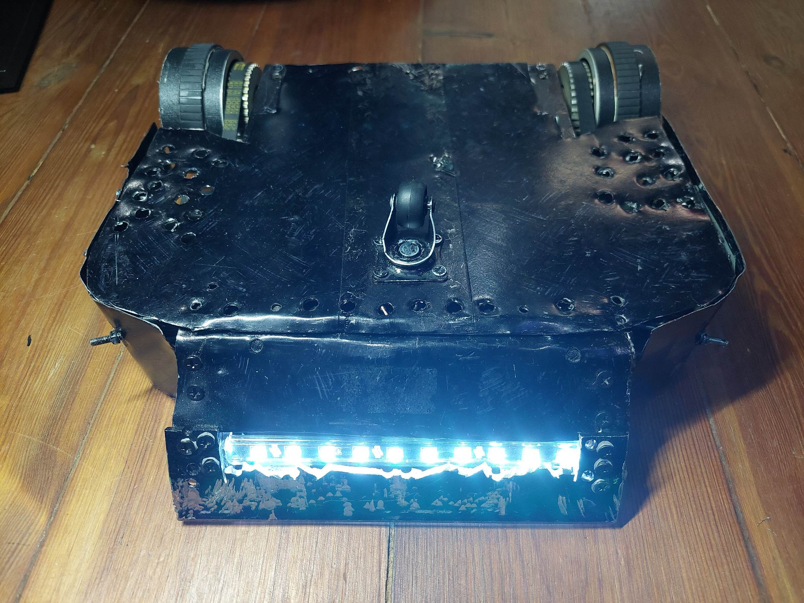
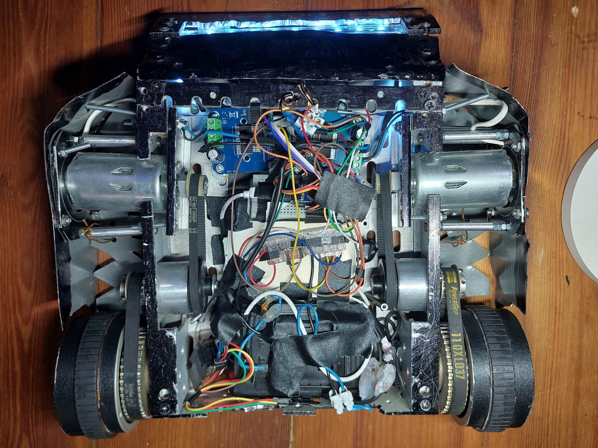
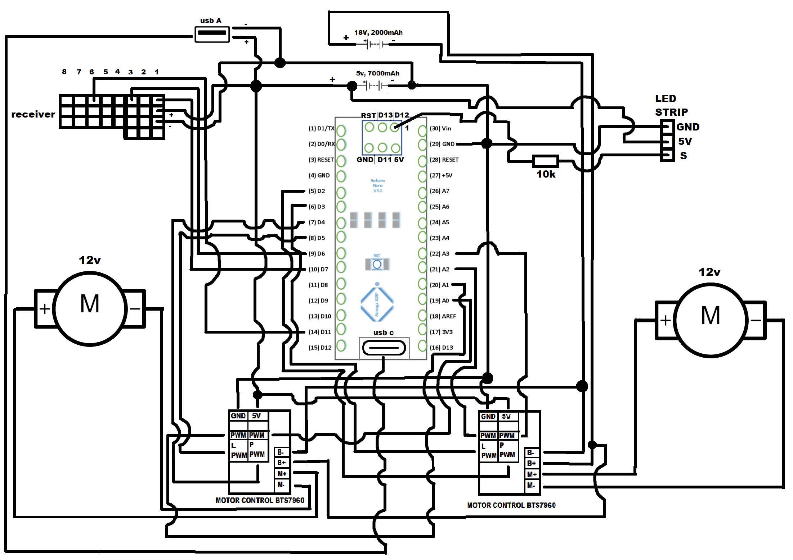

# Robot_Fight-Fantom
## General info
 I saw competition, in my school in december 2022. So I was going to create robot to this. Construction and programming took about 2 months.
 I used arduino nano, to control robot. There is two motors 12v and two motor control BTS7960 43A. All this thinks are on the electronic schematic.
 - Weight: 4.9kg; 
 - Dimensions: 32.5cm x 32.5cm x 9.3cm
	
## Technologies
Project is created with:
* C/C++
 
## Setup
To run this project, install arduino ide to upload code to arduino nano.

## The most important photos
Other photos in folder pictures.

## electronic Schematic

